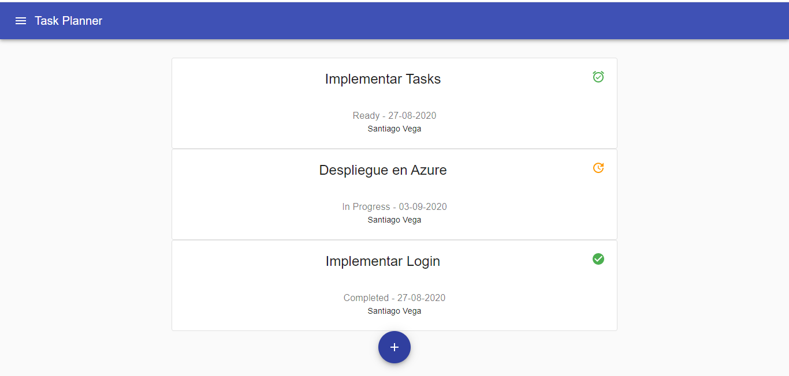
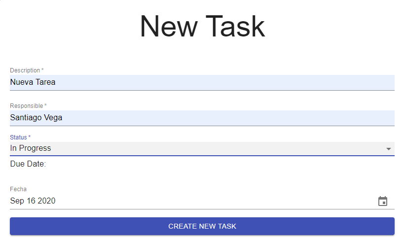
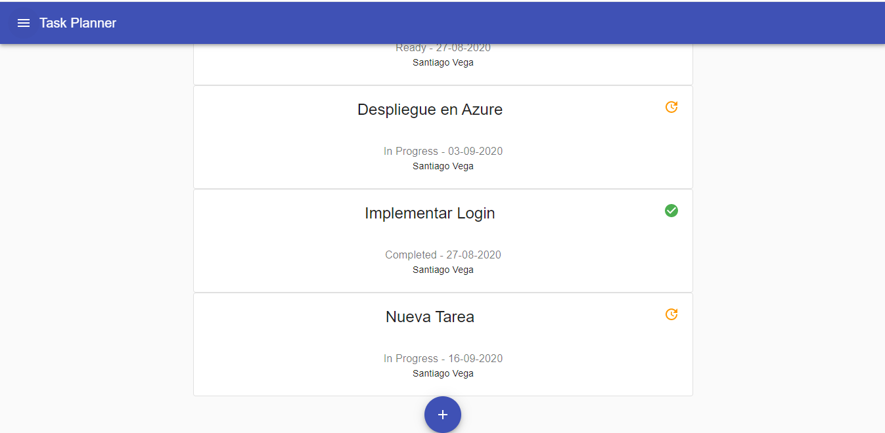
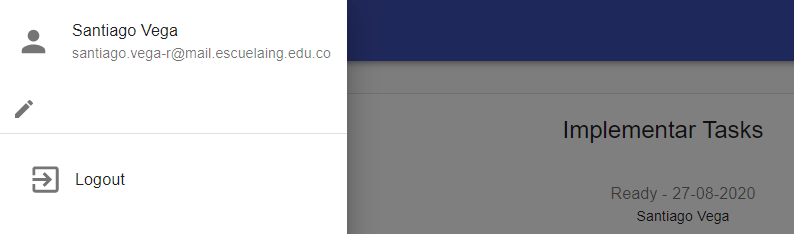
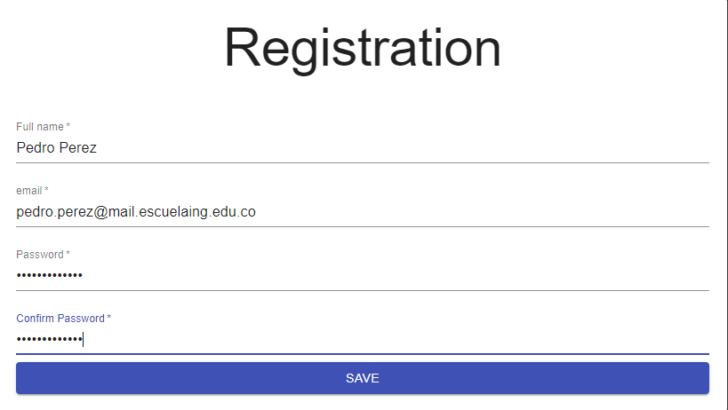
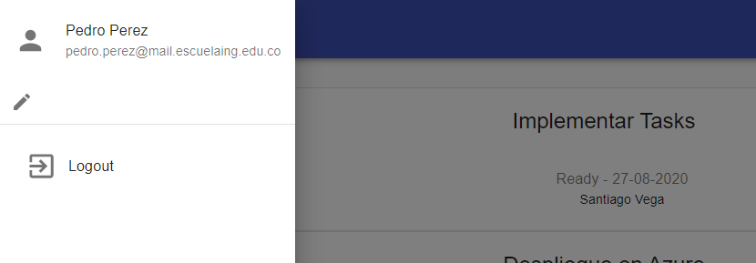

# 1.4 Task Planner Project - Front End - Part 2

La presencia de este documento en este repositorio es un compromiso explícito de los colaboradores de seguir el siguiente código de honor:

Código de Honor
------
Debes seguir el Código de honor del ingeniero de sistemas para defender el estándar de integridad académica de la ECI:

- Tus respuestas a tareas, cuestionarios y exámenes deben ser tu propio trabajo (excepto para las tareas que permiten explícitamente la colaboración).

- No puedes compartir tus soluciones de tareas, cuestionarios o exámenes con otra persona a menos que el instructor lo permita explícitamente. Esto incluye cualquier cosa escrita por ti, como también cualquier solución oficial proporcionada por el docente o el monitor del curso.

- No puedes participar en otras actividades que mejorarán de manera deshonesta tus resultados o que mejorarán de manera deshonesta o dañarán los resultados de otras personas.
## Inicio de Sesión

Usuario: santiago.vega-r
Contraseña: pass

## Creación de nueva tarea

1. Se da click en el botón "+".

2. Se completa el formulario.

3. Tarea creada exitosamente.

## Actualizar información usuario

1. En el drawer se da click en el icono de editar

2. Se completa el formulario.

3. Información actualizada.

## Aplicar Filtros

## Heroku Deploy

